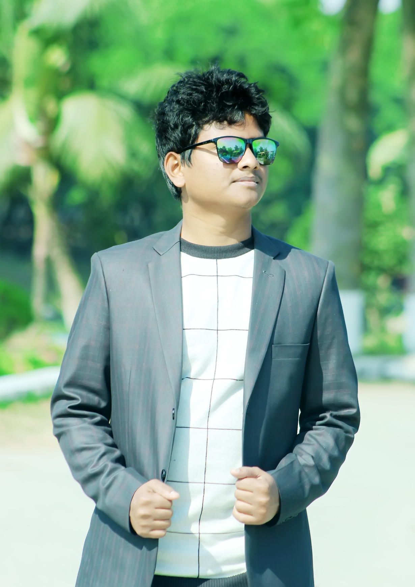

 
# 👋 Hey, I'm Rakibul islam
**_A professional Reactjs and React native developer 📲_** 
### Connect with me : 
👉 

**👨‍🏫 About Me**

I currently study in computer science and engineering(cse) in Begum Rokeya University, Rangpur(BRUR). I'm very passionate about problem solving with programming. So, I do problem solving in different platforms like Hackerrank, Leetcode, Codeforces. Now, I'm a professional Reactjs and React native developer as well with clean concepts and projects. 

### Skills
- Solid foundation on html and css.
- Css framework(Tailwind css).
- Solid concept on core javascript and oop.
- Strong foundation on Reactjs.
- strong foundation on React native.

### Projects
- 4 web application with Tailwind css and recatjs.
- 3 clone mobile apps with react native.
### Education
| Institution | Degree | Year |
|-------------|---------|------|
| Begum Rokeya university, Rangpur(BRUR) | BSc.(Engineering) | 2024 |
| Carmichael collegiate school and college, Rangpur | HSC | 2020 |

### Contact informations
- 👉 Email : raqibrahat594@gmail.com

- 👉 [Facebook](https://www.facebook.com/profile.php?id=100079727335102)
- 👉 [Linkedin](www.linkedin.com/in/raqibrahat)

#      Thanks 🤝
